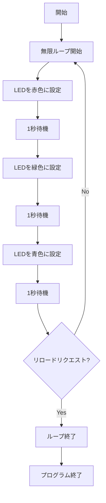

# Blink で使用する Ruby の基本的な使い方

## 概要

Blink は、組み込みデバイス向けの軽量な Ruby 実行環境（mruby）を使用したプログラミングフレームワークです。このドキュメントでは、Blink での基本的な Ruby の使い方について説明します。

## 基本的なプログラム構造

Blink では、Ruby の文法を使用してデバイスを制御するプログラムを記述します。以下は、LED を赤、緑、青と順番に点灯させる基本的なプログラム例です：

```ruby
while true do
  # Red
  LED.set([255, 0, 0])
  sleep 1

  # Green
  LED.set([0, 255, 0])
  sleep 1

  # Blue
  LED.set([0, 0, 255])
  sleep 1

  # Check if reload is requested
  break if Blink.req_reload?
end
```

## プログラムの解説

### 無限ループ

```ruby
while true do
  # プログラム内容
end
```

`while true do ... end`は無限ループを作成します。これにより、プログラムは明示的に中断されるまで繰り返し実行されます。

### LED の制御

```ruby
LED.set([255, 0, 0])  # 赤色に設定
```

`LED.set`メソッドは、RGB（赤、緑、青）の値を配列で受け取り、LED の色を設定します。各色の値は 0〜255 の範囲で指定します：

- `[255, 0, 0]` - 赤色
- `[0, 255, 0]` - 緑色
- `[0, 0, 255]` - 青色

### 待機処理

```ruby
sleep 1
```

`sleep`関数は、指定された秒数だけプログラムの実行を一時停止します。この例では、各色の LED が 1 秒間点灯した後、次の色に切り替わります。

### リロードリクエストの確認と処理

```ruby
break if Blink.req_reload?
```

この行は、Blink システムからのリロードリクエストを確認し、リクエストがある場合にループを終了（`break`）します。

#### `Blink.req_reload?`メソッドの動作

`Blink.req_reload?`メソッドは以下のように動作します：

1. **リロードリクエストの確認**：

   - Blink システムからプログラムのリロードが要求されているかどうかを確認します
   - 戻り値は真偽値（boolean）です

2. **戻り値**：

   - `true`：リロードリクエストが存在する場合
   - `false`：リロードリクエストがない場合

3. **使用例**：

   ```ruby
   break if Blink.req_reload?  # リロードリクエストがあればループを抜ける
   ```

   または

   ```ruby
   return if Blink.req_reload?  # リロードリクエストがあれば関数から抜ける
   ```

4. **目的**：
   - プログラムの安全な終了を可能にする
   - 新しいプログラムのロードを準備する
   - システムの状態を適切に管理する

## プログラムの実行フロー

以下の図は、サンプルプログラムの実行フローを示しています：



## まとめ

このサンプルプログラムは、Blink を使用した Ruby プログラミングの基本的な概念を示しています：

1. 無限ループを使用して継続的な処理を実行
2. `LED.set`メソッドを使用して LED の色を制御
3. `sleep`関数を使用してタイミングを制御
4. `Blink.req_reload?`を使用してシステムからのリロードリクエストを適切に処理

これらの基本的な概念を理解することで、より複雑な Blink プログラムを開発することができます。
