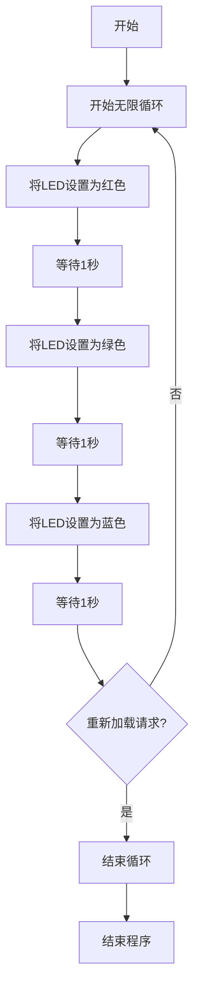

# Blink 中 Ruby 的基本用法

## 概述

Blink 是一个使用轻量级 Ruby 执行环境（mruby）的嵌入式设备编程框架。本文档介绍了在 Blink 中使用 Ruby 的基本方法。

## 基本程序结构

在 Blink 中，您可以使用 Ruby 语法编写控制设备的程序。以下是一个基本程序示例，该示例按顺序将 LED 点亮为红色、绿色和蓝色：

```ruby
while true do
  # Red
  LED.set([255, 0, 0])
  sleep 1

  # Green
  LED.set([0, 255, 0])
  sleep 1

  # Blue
  LED.set([0, 0, 255])
  sleep 1

  # Check if reload is requested
  break if Blink.req_reload?
end
```

## 程序解释

### 无限循环

```ruby
while true do
  # 程序内容
end
```

`while true do ... end`创建一个无限循环。这使程序能够重复运行，直到明确中断为止。

### LED 控制

```ruby
LED.set([255, 0, 0])  # 设置为红色
```

`LED.set`方法接收一个 RGB（红、绿、蓝）值数组并设置 LED 颜色。每个颜色值的范围为 0-255：

- `[255, 0, 0]` - 红色
- `[0, 255, 0]` - 绿色
- `[0, 0, 255]` - 蓝色

### 等待处理

```ruby
sleep 1
```

`sleep`函数暂停程序执行指定的秒数。在此示例中，每种 LED 颜色亮起 1 秒后，切换到下一种颜色。

### 检查和处理重新加载请求

```ruby
break if Blink.req_reload?
```

此行检查来自 Blink 系统的重新加载请求，如果存在请求，则退出循环（`break`）。

#### `Blink.req_reload?`方法的工作原理

`Blink.req_reload?`方法的工作原理如下：

1. **检查重新加载请求**：

   - 检查 Blink 系统是否请求重新加载程序
   - 返回值是布尔值

2. **返回值**：

   - `true`：如果存在重新加载请求
   - `false`：如果没有重新加载请求

3. **使用示例**：

   ```ruby
   break if Blink.req_reload?  # 如果有重新加载请求，则退出循环
   ```

   或

   ```ruby
   return if Blink.req_reload?  # 如果有重新加载请求，则退出函数
   ```

4. **目的**：
   - 使程序能够安全终止
   - 为加载新程序做准备
   - 正确管理系统状态

## 程序执行流程

下图显示了示例程序的执行流程：



## 总结

这个示例程序演示了使用 Blink 进行 Ruby 编程的基本概念：

1. 使用无限循环执行连续处理
2. 使用`LED.set`方法控制 LED 颜色
3. 使用`sleep`函数控制时间
4. 使用`Blink.req_reload?`正确处理来自系统的重新加载请求

理解这些基本概念将使您能够开发更复杂的 Blink 程序。
