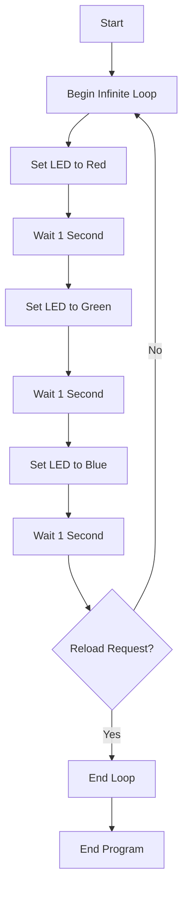

# Basic Ruby Usage in Blink

## Overview

Blink is a programming framework that uses a lightweight Ruby execution environment (mruby) for embedded devices. This document explains the basic usage of Ruby in Blink.

## Basic Program Structure

In Blink, you write programs to control devices using Ruby syntax. Below is a basic program example that lights up an LED in red, green, and blue in sequence:

```ruby
while true do
  # Red
  LED.set([255, 0, 0])
  sleep 1

  # Green
  LED.set([0, 255, 0])
  sleep 1

  # Blue
  LED.set([0, 0, 255])
  sleep 1

  # Check if reload is requested
  break if Blink.req_reload?
end
```

## Program Explanation

### Infinite Loop

```ruby
while true do
  # Program content
end
```

`while true do ... end` creates an infinite loop. This allows the program to run repeatedly until explicitly interrupted.

### LED Control

```ruby
LED.set([255, 0, 0])  # Set to red
```

The `LED.set` method takes an array of RGB (Red, Green, Blue) values and sets the LED color. Each color value is specified in the range of 0-255:

- `[255, 0, 0]` - Red
- `[0, 255, 0]` - Green
- `[0, 0, 255]` - Blue

### Wait Processing

```ruby
sleep 1
```

The `sleep` function pauses the execution of the program for the specified number of seconds. In this example, each LED color stays lit for 1 second before switching to the next color.

### Checking and Handling Reload Requests

```ruby
break if Blink.req_reload?
```

This line checks for a reload request from the Blink system and exits the loop (`break`) if a request exists.

#### How the `Blink.req_reload?` Method Works

The `Blink.req_reload?` method works as follows:

1. **Checking for Reload Requests**:

   - Checks if a program reload has been requested from the Blink system
   - The return value is a boolean

2. **Return Values**:

   - `true`: If a reload request exists
   - `false`: If there is no reload request

3. **Usage Examples**:

   ```ruby
   break if Blink.req_reload?  # Exit the loop if there's a reload request
   ```

   or

   ```ruby
   return if Blink.req_reload?  # Exit the function if there's a reload request
   ```

4. **Purpose**:
   - Enables safe termination of the program
   - Prepares for loading a new program
   - Properly manages the system state

## Program Execution Flow

The following diagram shows the execution flow of the sample program:



## Summary

This sample program demonstrates the basic concepts of Ruby programming using Blink:

1. Using an infinite loop to perform continuous processing
2. Using the `LED.set` method to control LED colors
3. Using the `sleep` function to control timing
4. Using `Blink.req_reload?` to properly handle reload requests from the system

Understanding these basic concepts will allow you to develop more complex Blink programs.
